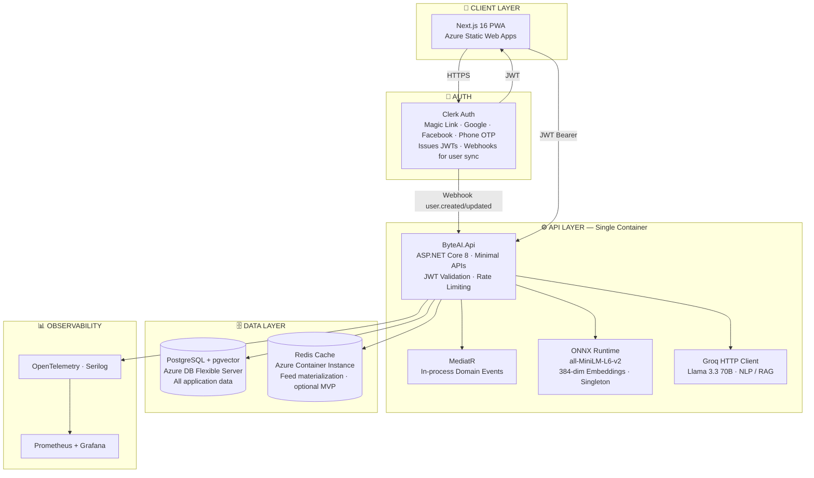
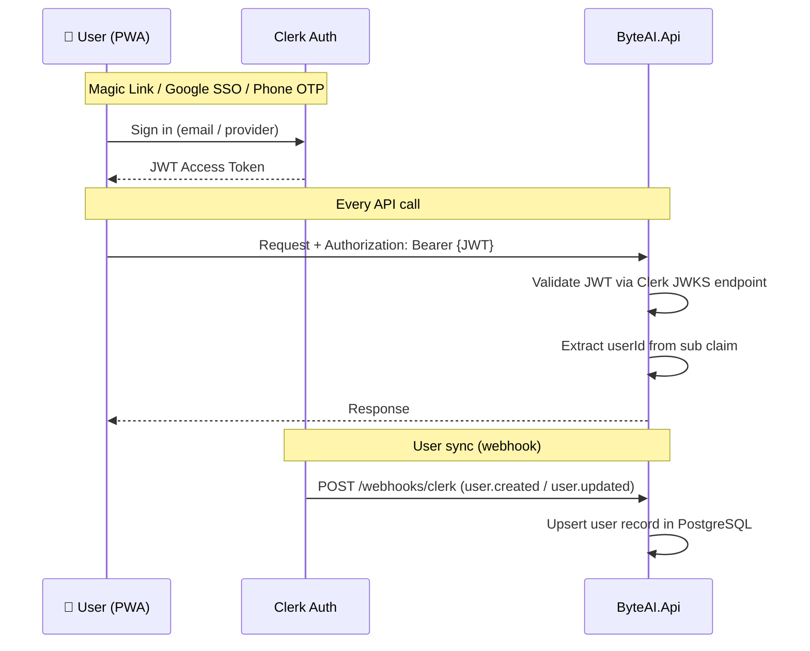
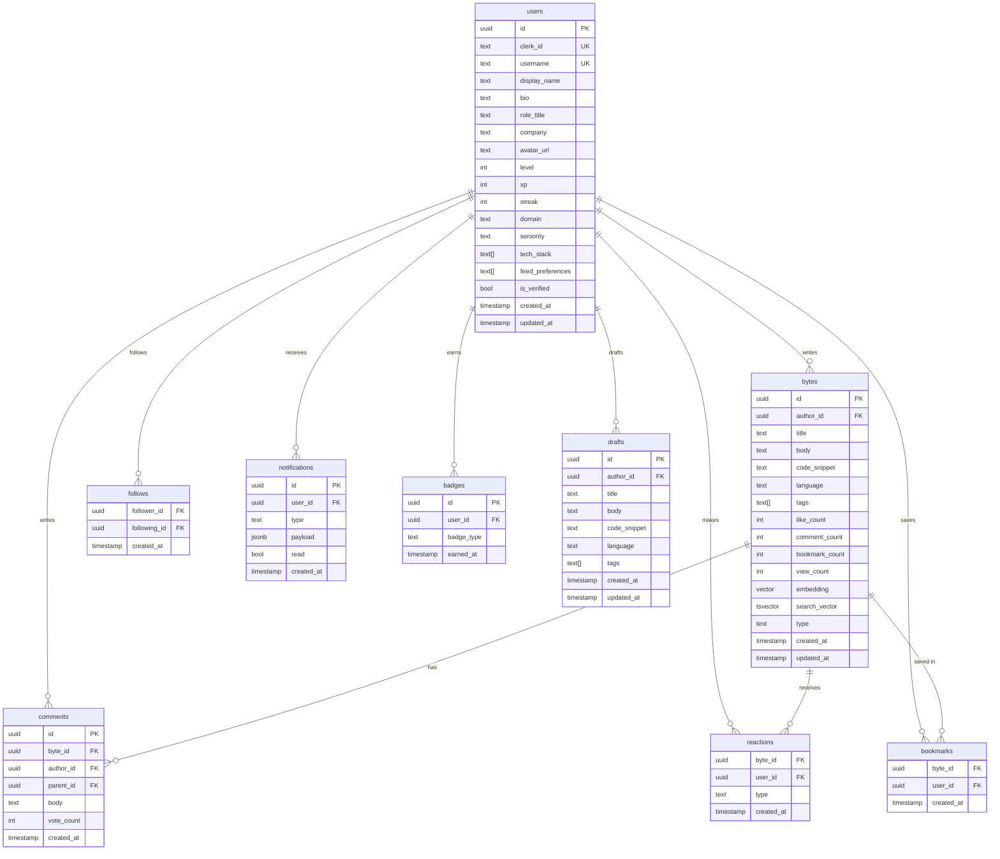
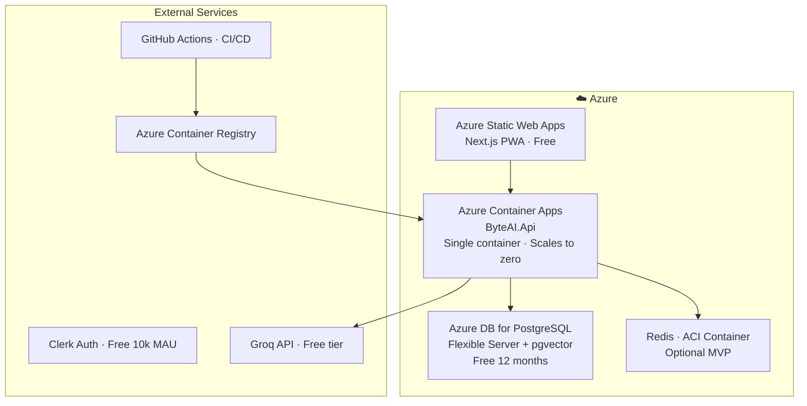

# ByteAI — Backend Architecture (Monolith Phase)

> **Decision (2026-04-09):** Start as a single ASP.NET Core 8 monolith.
> Microservices extraction is deferred. The vertical-slice folder structure means
> any domain can be promoted to its own service later without rewriting business logic.

---

## 1. High-Level System Overview



---

## 2. Auth Flow



---

## 3. Solution Structure

> **Architecture decision (2026-04-09):** 3-project solution. Table-first approach — schema lives in
> `supabase/tables/*.sql`; EF Core reads existing tables via Fluent API configurations.
> No EF Core migrations. No `__EFMigrationsHistory`.

```
ByteAI.sln
│
├── Service/
│   │
│   ├── ByteAI.Api/                       ← ASP.NET Core 9 Web API (HTTP surface only)
│   │   ├── ByteAI.Api.csproj             ← References ByteAI.Core
│   │   ├── Program.cs                    ← DI wiring, middleware pipeline (no auto-migrate)
│   │   ├── appsettings.json
│   │   ├── appsettings.Development.json  ← local connection strings (gitignored)
│   │   ├── Dockerfile
│   │   │
│   │   ├── Controllers/                  ← MVC controllers, one per domain
│   │   │   ├── BytesController.cs        ← /api/bytes/**
│   │   │   ├── UsersController.cs        ← /api/users/**
│   │   │   ├── FeedController.cs         ← /api/feed/**
│   │   │   ├── CommentsController.cs     ← /api/bytes/:id/comments/**
│   │   │   ├── ReactionsController.cs    ← /api/bytes/:id/reactions/**
│   │   │   ├── BookmarksController.cs    ← /api/bookmarks/**
│   │   │   ├── FollowController.cs       ← /api/users/:id/follow/**
│   │   │   ├── SearchController.cs       ← /api/search/**
│   │   │   ├── NotificationsController.cs← /api/notifications/**
│   │   │   └── AiController.cs           ← /api/ai/**
│   │   │
│   │   ├── ViewModels/                   ← Request / response records (immutable)
│   │   │   ├── ByteViewModels.cs         ← CreateByteRequest, ByteResponse, …
│   │   │   ├── UserViewModels.cs         ← UpdateProfileRequest, UserResponse, …
│   │   │   ├── CommentViewModels.cs
│   │   │   ├── FeedViewModels.cs
│   │   │   └── Common/
│   │   │       ├── ApiResponse.cs        ← ApiResponse<T>, PagedResponse<T>
│   │   │       └── Pagination.cs
│   │   │
│   │   └── Mappers/                      ← Static extension methods: ViewModel ↔ Entity
│   │       ├── ByteMappers.cs            ← ToEntity(), ToResponse()
│   │       ├── UserMappers.cs
│   │       └── CommentMappers.cs
│   │
│   └── ByteAI.Core/                      ← Class library — domain + application logic
│       ├── ByteAI.Core.csproj            ← net9.0; EF Core, FluentValidation, MediatR, Npgsql, Pgvector
│       │
│       ├── Entities/                     ← Pure domain entity classes (no EF attributes)
│       │   ├── User.cs
│       │   ├── Byte.cs
│       │   ├── Comment.cs
│       │   ├── Follow.cs
│       │   ├── Reaction.cs
│       │   ├── Bookmark.cs
│       │   ├── Notification.cs
│       │   ├── Badge.cs
│       │   ├── Draft.cs
│       │   └── Configurations/           ← EF Core Fluent API — maps to existing PG tables
│       │       ├── UserConfiguration.cs
│       │       ├── ByteConfiguration.cs
│       │       ├── CommentConfiguration.cs
│       │       ├── ReactionConfiguration.cs
│       │       ├── BookmarkConfiguration.cs
│       │       ├── FollowConfiguration.cs
│       │       ├── NotificationConfiguration.cs
│       │       ├── BadgeConfiguration.cs
│       │       └── DraftConfiguration.cs
│       │
│       ├── Validators/                   ← FluentValidation per entity / command
│       │   ├── UserValidator.cs
│       │   ├── ByteValidator.cs
│       │   └── CommentValidator.cs
│       │
│       ├── Services/                     ← Business logic — interface + implementation
│       │   ├── Bytes/
│       │   │   ├── IByteService.cs
│       │   │   └── ByteService.cs
│       │   ├── Feed/
│       │   │   ├── IFeedService.cs
│       │   │   └── FeedService.cs        ← FOR_YOU / FOLLOWING / TRENDING scoring
│       │   ├── Search/
│       │   │   ├── ISearchService.cs
│       │   │   └── SearchService.cs      ← full-text + pgvector hybrid
│       │   ├── AI/
│       │   │   ├── IEmbeddingService.cs
│       │   │   ├── EmbeddingService.cs   ← ONNX Runtime singleton
│       │   │   ├── IGroqService.cs
│       │   │   └── GroqService.cs        ← Groq API HTTP client
│       │   └── Notifications/
│       │       ├── INotificationService.cs
│       │       └── NotificationService.cs
│       │
│       ├── Commands/                     ← MediatR IRequest + IRequestHandler per domain
│       │   ├── Bytes/
│       │   │   ├── CreateByteCommand.cs
│       │   │   ├── CreateByteCommandHandler.cs
│       │   │   ├── UpdateByteCommand.cs
│       │   │   ├── UpdateByteCommandHandler.cs
│       │   │   ├── DeleteByteCommand.cs
│       │   │   ├── DeleteByteCommandHandler.cs
│       │   │   ├── GetBytesQuery.cs
│       │   │   ├── GetBytesQueryHandler.cs
│       │   │   ├── GetByteByIdQuery.cs
│       │   │   └── GetByteByIdQueryHandler.cs
│       │   ├── Users/
│       │   │   ├── UpdateProfileCommand.cs
│       │   │   ├── UpdateProfileCommandHandler.cs
│       │   │   ├── GetUserByUsernameQuery.cs
│       │   │   └── GetUserByUsernameQueryHandler.cs
│       │   ├── Reactions/
│       │   ├── Bookmarks/
│       │   ├── Comments/
│       │   └── Follow/
│       │
│       ├── Events/                       ← MediatR INotification + INotificationHandler
│       │   ├── ByteCreatedEvent.cs       ← triggers embed + tag via MediatR
│       │   ├── ByteCreatedEventHandler.cs← OnnxEmbedder + GroqService + FeedInvalidate
│       │   ├── ByteReactedEvent.cs       ← triggers XP award + notification
│       │   ├── ByteReactedEventHandler.cs
│       │   ├── UserFollowedEvent.cs      ← triggers notification
│       │   └── UserFollowedEventHandler.cs
│       │
│       └── Infrastructure/
│           ├── Persistence/
│           │   └── AppDbContext.cs       ← EF Core DbContext; applies all IEntityTypeConfiguration<T>
│           ├── Cache/
│           │   └── RedisFeedCache.cs     ← optional Redis feed wrapper
│           └── AI/
│               └── OnnxEmbedder.cs      ← loads model, runs inference
│
├── supabase/
│   ├── config.toml                       ← Supabase local dev config
│   └── tables/                           ← ⭐ Schema source of truth (table-first)
│       ├── users.sql
│       ├── bytes.sql
│       ├── comments.sql
│       ├── reactions.sql
│       ├── bookmarks.sql
│       ├── follows.sql
│       ├── notifications.sql
│       ├── badges.sql
│       └── drafts.sql
│
├── tests/
│   └── ByteAI.Tests/                     ← Renamed from ByteAI.Api.Tests
│       ├── ByteAI.Tests.csproj
│       ├── Commands/                     ← Unit tests per command handler
│       ├── Services/                     ← Unit tests per service
│       └── Integration/                  ← WebApplicationFactory tests
│
└── infra/
    ├── docker-compose.yml                ← api + pgvector/pgvector:pg16 + redis:7-alpine
    └── bicep/
        ├── main.bicep                    ← 1 Container App
        └── databases.bicep
```

### Project Dependency Graph

```
ByteAI.Api  ──→  ByteAI.Core
ByteAI.Tests ──→  ByteAI.Core
ByteAI.Tests ──→  ByteAI.Api   (WebApplicationFactory)
```

### Table-First Workflow

```
supabase/tables/*.sql          ← Developer edits schema here
    │
    ▼  (supabase db push / psql)
PostgreSQL tables              ← Source of truth at runtime
    │
    ▼  (EF Core Fluent API configs in ByteAI.Core/Entities/Configurations/)
AppDbContext                   ← Reads existing tables; NO migrations; NO __EFMigrationsHistory
```

---

## 4. API Endpoints

| Method | Route | Feature | Auth |
|--------|-------|---------|------|
| `POST` | `/webhooks/clerk` | Auth | Clerk signature |
| `GET` | `/api/users/me` | Users | JWT |
| `GET` | `/api/users/:username` | Users | public |
| `PUT` | `/api/users/me` | Users | JWT |
| `PUT` | `/api/users/me/preferences` | Users | JWT |
| `POST` | `/api/users/:username/follow` | Users | JWT |
| `DELETE` | `/api/users/:username/follow` | Users | JWT |
| `GET` | `/api/bytes` | Bytes | public |
| `POST` | `/api/bytes` | Bytes | JWT |
| `GET` | `/api/bytes/:id` | Bytes | public |
| `DELETE` | `/api/bytes/:id` | Bytes | JWT (owner) |
| `POST` | `/api/bytes/:id/like` | Bytes | JWT |
| `DELETE` | `/api/bytes/:id/like` | Bytes | JWT |
| `POST` | `/api/bytes/:id/bookmark` | Bytes | JWT |
| `DELETE` | `/api/bytes/:id/bookmark` | Bytes | JWT |
| `GET` | `/api/bytes/:id/comments` | Bytes | public |
| `POST` | `/api/bytes/:id/comments` | Bytes | JWT |
| `GET` | `/api/feed` | Feed | JWT |
| `GET` | `/api/search` | Search | public |
| `GET` | `/api/notifications` | Notifications | JWT |
| `PUT` | `/api/notifications/:id/read` | Notifications | JWT |
| `POST` | `/api/ai/suggest-tags` | AI | JWT |
| `POST` | `/api/ai/ask` | AI | JWT |

---

## 5. Data Model (PostgreSQL Only)



---

## 6. In-Process Event Flow (MediatR)

Replaces RabbitMQ for the monolith phase. Events are synchronous but handlers
can be made async with background `IHostedService` if needed.

```
POST /api/bytes
  └── BytesService.CreateAsync()
        ├── INSERT INTO bytes
        └── Publish ByteCreatedEvent
              ├── EmbeddingHandler    → OnnxEmbedder → UPDATE bytes SET embedding
              ├── TaggingHandler      → GroqService  → UPDATE bytes SET tags
              └── FeedInvalidateHandler → RedisFeedCache.InvalidateAsync()

POST /api/bytes/:id/like
  └── BytesService.LikeAsync()
        ├── INSERT INTO reactions
        ├── UPDATE bytes SET like_count
        └── Publish ByteReactedEvent
              ├── XpHandler           → award XP to author → UPDATE users SET xp
              └── NotificationHandler → INSERT INTO notifications
```

---

## 7. Feed Personalisation

No Redis dependency for MVP — query Postgres directly with indexes.
Redis added as a caching layer once traffic warrants it.

```
GET /api/feed?filter=for_you
  └── FeedService.GetForYouAsync(userId)
        1. Fetch user.feed_preferences + user.interest_embedding from users table
        2. SELECT bytes
           ORDER BY (
             0.4 * cosine_similarity(embedding, user_interest_vec)  -- semantic match
           + 0.3 * recency_score(created_at)                        -- freshness
           + 0.2 * engagement_score(like_count, comment_count)      -- popularity
           + 0.1 * following_boost(author_id, following_ids)        -- social graph
           )
           LIMIT 20
```

---

## 8. Search — Hybrid Full-Text + Vector

```
GET /api/search?q=react+performance
  └── SearchService.SearchAsync(query)
        ├── Full-text:  WHERE search_vector @@ plainto_tsquery('react performance')
        ├── Vector:     ORDER BY embedding <=> query_embedding LIMIT 20
        └── Merge via Reciprocal Rank Fusion → return top 10
```

---

## 9. Deployment — Single Container



---

## 10. Technology Decisions

| Concern | Choice | Why |
|---|---|---|
| **Auth** | Clerk (free 10k MAU) | Magic Link · Google · FB · Phone OTP · zero infra |
| **API** | ASP.NET Core 8 Minimal APIs | Fast, clean, Primary Constructors, easy to test |
| **In-process events** | MediatR | Replaces RabbitMQ; same handler interface — extractable later |
| **ORM** | EF Core 9 + Npgsql (table-first) | PostgreSQL-native, LINQ queries; Fluent API configs map to existing tables; NO migrations |
| **Database** | PostgreSQL (Azure Flexible) | ACID, pgvector, full-text search, free 12 months |
| **Document storage** | PostgreSQL `jsonb` | Replaces MongoDB — flexible enough for bytes metadata |
| **Vector search** | pgvector (HNSW index) | No extra service, built into PostgreSQL |
| **Embeddings** | ONNX Runtime all-MiniLM-L6-v2 | In-process, no GPU, 80MB, 384-dim |
| **LLM / NLP** | Groq — Llama 3.3 70B | Free tier, fastest inference |
| **Cache** | Redis (ACI) | Feed materialisation — optional for MVP |
| **Observability** | OpenTelemetry + Serilog + Grafana | Free, .NET-native |
| **Container** | Azure Container Apps | Scale to zero, free tier, single container |
| **IaC** | Bicep | Azure-native, simpler than Terraform |
| **CI/CD** | GitHub Actions | Free, Docker build + push to ACR + deploy to ACA |

---

## 11. Estimated Monthly Cost

| Service | Free Tier | Est. Cost |
|---|---|---|
| Azure Static Web Apps | Free forever | $0 |
| Azure Container Apps | 180k vCPU-sec/month free | $0–5 |
| Azure DB for PostgreSQL | Free 12 months | $0 → $15/mo after |
| Redis (ACI) | No free tier | $10–15 |
| Clerk Auth | Free 10k MAU | $0 |
| Groq API | Free tier | $0 |
| Azure Container Registry | Free tier | $0 |
| GitHub Actions | Free public repos | $0 |
| **Total** | | **$0–20/month** |

---

## 12. Future Migration Path to Microservices

When the time comes, each domain can be extracted without rewriting:

1. Copy `Features/<Domain>/` → new `ByteAI.<Domain>Service` project
2. Move DB tables for that domain to a separate Postgres schema or instance
3. Replace `MediatR` events with RabbitMQ/MassTransit at the extracted boundary
4. Add YARP Gateway to route between services

The monolith acts as a living specification for what each future service needs to do.
