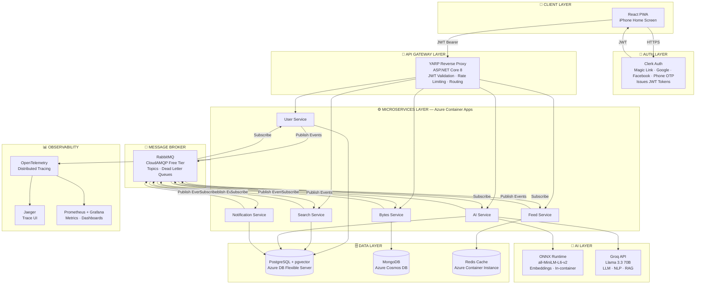
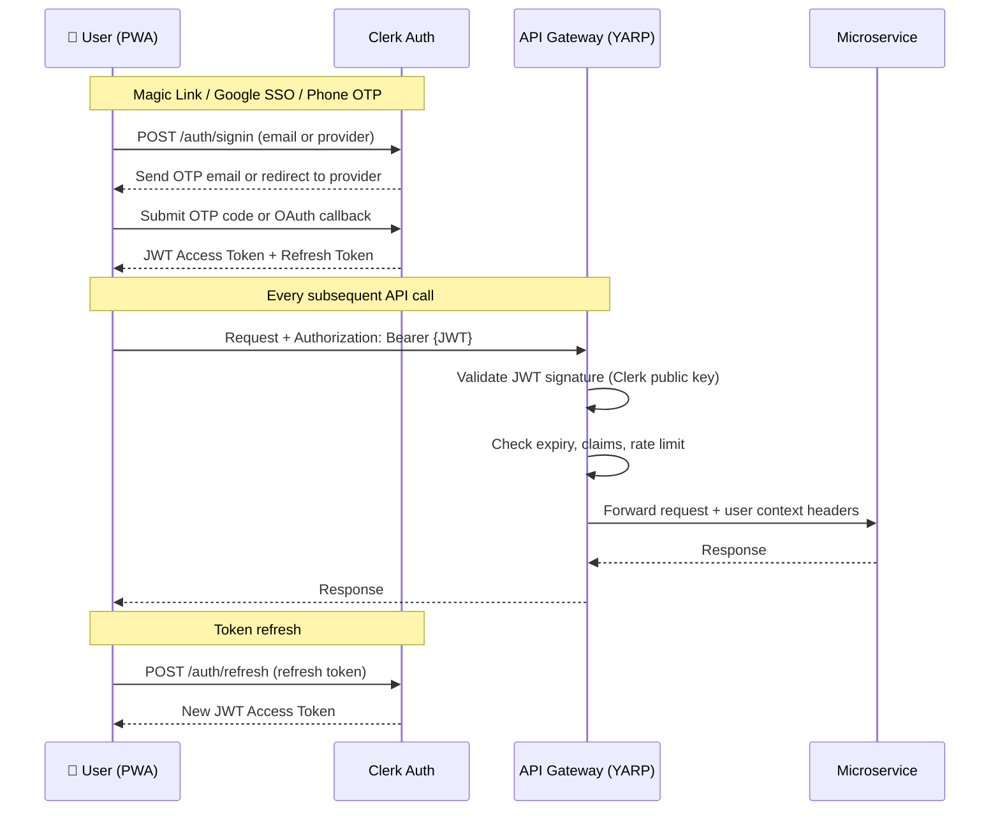
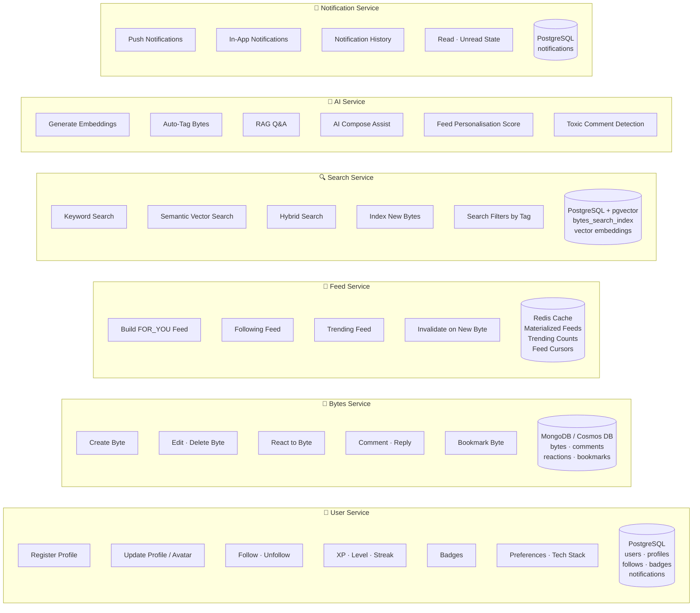
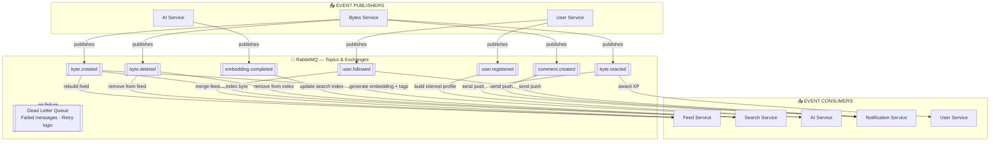
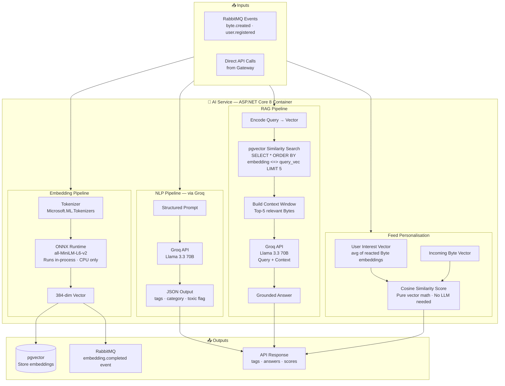
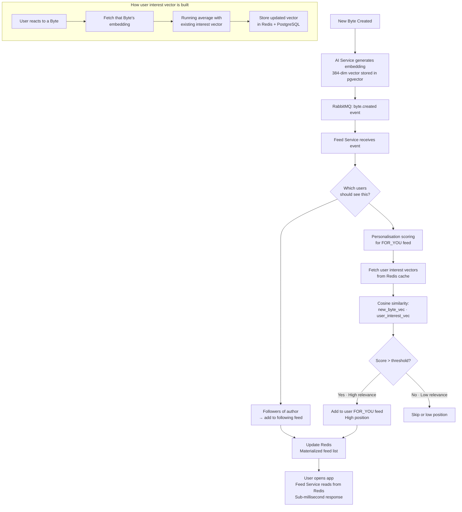
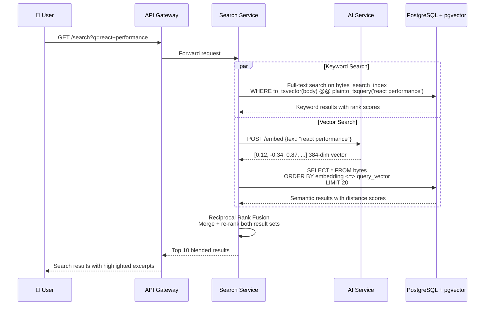
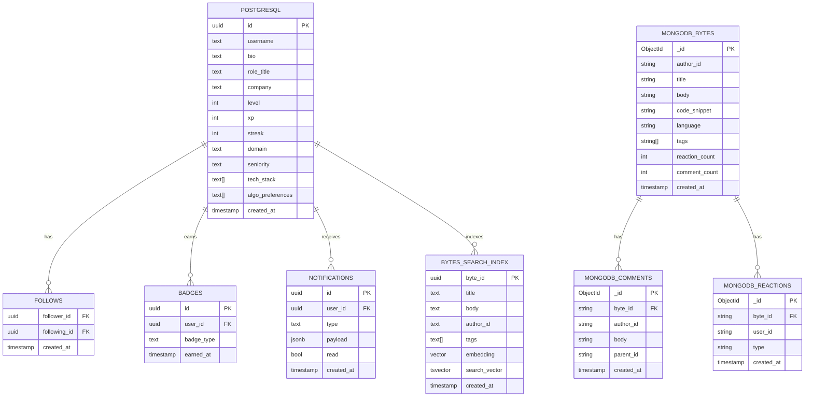
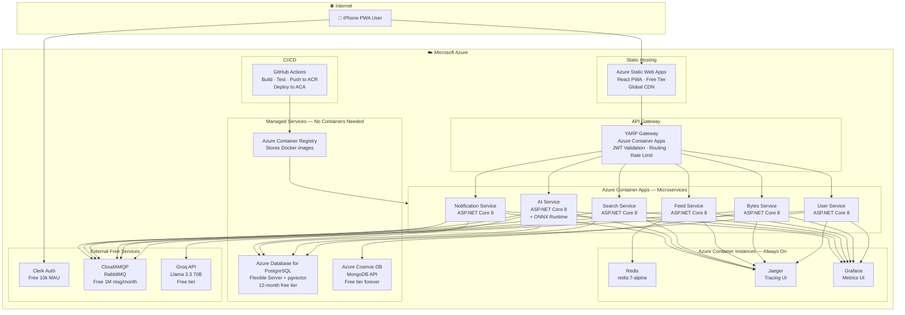

# ByteAI — Backend Architecture

---

## 1. High-Level System Overview



---

## 2. Auth Flow



---

## 3. Microservices — Responsibilities & Data Ownership



---

## 4. Event Flow — RabbitMQ Topics



---

## 5. AI Service — Internal Architecture



---

## 6. Feed Personalisation Algorithm



---

## 7. Search Flow — Hybrid Keyword + Vector



---

## 8. Data Architecture



---

## 9. Deployment Architecture on Azure



---

## 10. .NET Solution Structure

```
ByteAI.sln
│
├── src/
│   ├── Services/
│   │   ├── ByteAI.UserService/
│   │   │   ├── Controllers/
│   │   │   ├── Domain/
│   │   │   │   ├── Entities/        User.cs · Follow.cs · Badge.cs
│   │   │   │   ├── Events/          UserRegisteredEvent.cs
│   │   │   │   └── Repositories/   IUserRepository.cs
│   │   │   ├── Infrastructure/
│   │   │   │   ├── Persistence/     PostgresUserRepository.cs
│   │   │   │   └── Messaging/       UserEventPublisher.cs
│   │   │   ├── Application/
│   │   │   │   ├── Commands/        RegisterUserCommand.cs
│   │   │   │   └── Queries/         GetUserProfileQuery.cs
│   │   │   ├── Consumers/           ByteReactedConsumer.cs
│   │   │   └── Program.cs
│   │   │
│   │   ├── ByteAI.BytesService/     (same structure)
│   │   ├── ByteAI.FeedService/      (same structure)
│   │   ├── ByteAI.SearchService/    (same structure)
│   │   ├── ByteAI.AIService/        (same structure + /Models/)
│   │   └── ByteAI.NotificationService/
│   │
│   ├── Gateway/
│   │   └── ByteAI.Gateway/
│   │       ├── Program.cs           YARP config · JWT validation
│   │       └── appsettings.json     Route mappings
│   │
│   └── Shared/
│       ├── ByteAI.Shared.Contracts/ Shared event contracts · DTOs
│       ├── ByteAI.Shared.Auth/      JWT helpers · ClaimsPrincipal extensions
│       └── ByteAI.Shared.Messaging/ MassTransit setup · Base consumers
│
├── tests/
│   ├── ByteAI.UserService.Tests/    Unit + integration tests
│   ├── ByteAI.BytesService.Tests/
│   └── ByteAI.Integration.Tests/   End-to-end API tests
│
├── infra/
│   ├── docker-compose.yml           Local dev: all services + deps
│   ├── docker-compose.infra.yml     Local dev: Redis · RabbitMQ · PG · Mongo
│   └── bicep/                       Azure IaC
│       ├── main.bicep
│       ├── containerApps.bicep
│       └── databases.bicep
│
└── .github/
    └── workflows/
        ├── ci.yml                   Build + test on PR
        └── cd.yml                   Deploy to Azure on merge to main
```

---

## 11. Key Technology Decisions

| Concern | Choice | Why |
|---|---|---|
| **Auth** | Clerk (free 10k MAU) | Handles Magic Link · Google · Facebook · Phone OTP · issues JWT · zero infra |
| **API Gateway** | YARP (ASP.NET Core) | .NET native · free · JWT validation · rate limiting · path routing |
| **Relational DB** | PostgreSQL (Azure Flexible) | Free 12mo · pgvector built-in · ACID · great with .NET |
| **Document DB** | MongoDB (Cosmos DB free) | Flexible schema for Bytes/comments · Azure-native · free tier |
| **Cache** | Redis (ACI container) | Materialized feeds · sub-ms reads · session cache |
| **Message Broker** | RabbitMQ (CloudAMQP) | Free 1M msg/month · pub/sub · dead letter queues · MassTransit |
| **Vector Search** | pgvector in PostgreSQL | No extra service · free · HNSW index · hybrid with full-text |
| **Embeddings** | all-MiniLM-L6-v2 (ONNX) | In-process · no API · no GPU · 384-dim · 80MB model |
| **LLM + NLP** | Groq — Llama 3.3 70B | Free tier · fastest inference · handles both NLP and generative |
| **Observability** | OpenTelemetry + Jaeger + Grafana | Free · distributed tracing · .NET native SDK |
| **Container Runtime** | Azure Container Apps | Scales to zero · serverless · free tier · best for microservices |
| **CI/CD** | GitHub Actions | Free · Azure integrations · builds Docker images · deploys to ACA |
| **IaC** | Bicep | Azure-native · simpler than Terraform for pure Azure stacks |

---

## 12. Estimated Monthly Cost

| Service | Free Tier | Est. Cost After Free |
|---|---|---|
| Azure Static Web Apps | ✅ Free forever | $0 |
| Azure Container Apps | 180k vCPU-sec/month free | $5–15 |
| Azure DB for PostgreSQL | ✅ Free 12 months | $15/mo after |
| Azure Cosmos DB (MongoDB) | ✅ Free forever (25GB) | $0 |
| Redis (ACI) | No free tier | $10–15 |
| CloudAMQP RabbitMQ | ✅ Free 1M msg/month | $0 |
| Clerk Auth | ✅ Free 10k MAU | $0 |
| Groq API | ✅ Free tier | $0 |
| Azure Container Registry | ✅ Free tier | $0 |
| GitHub Actions | ✅ Free for public repos | $0 |
| **Total** | | **$0–30/month** |